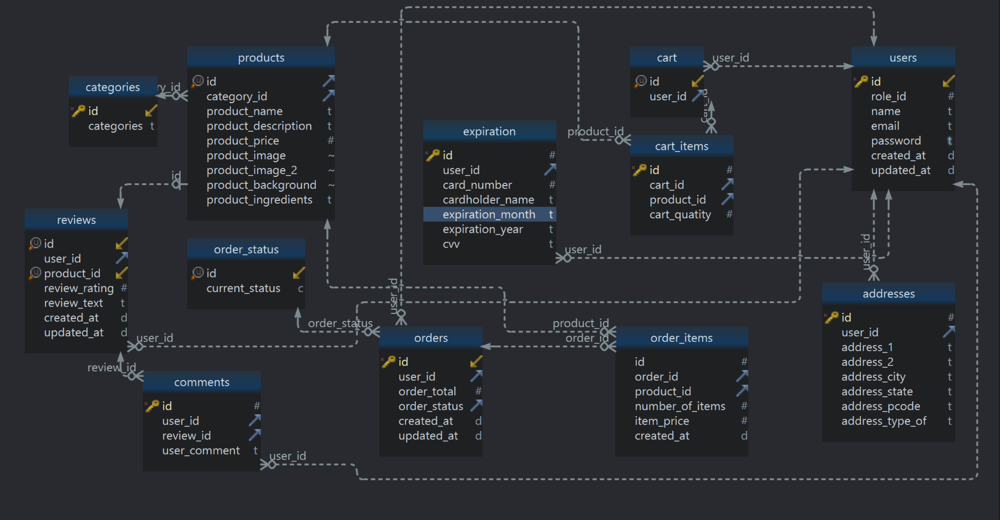
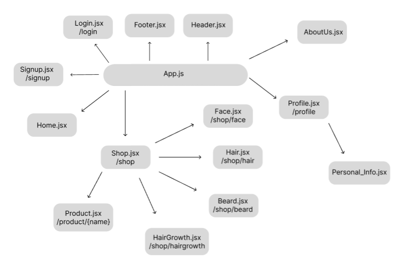
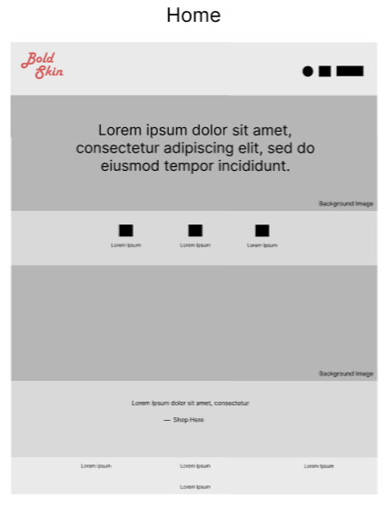
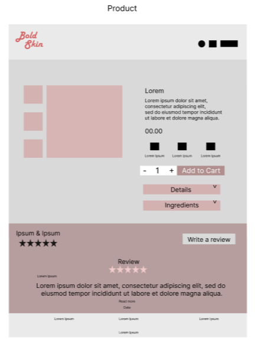
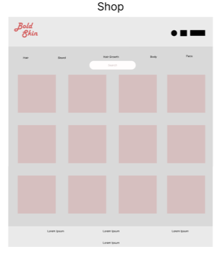
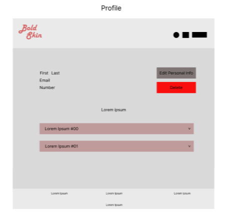
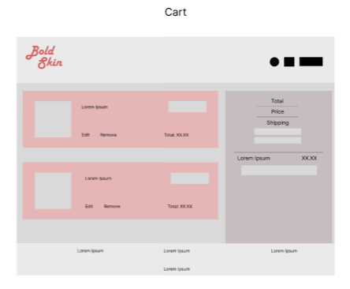

# Bold-Skin
Eccomerce For Concious and Sustainable Men's BeautyCare

# How to run
Honcho coming soon !
1. Open code in your Source code Editor(Vscode preferred)
2. Cd into Server
3. run pipenv install && pipenv shell
4. Open new terminal (or Split terminal)
5. cd into Client
6. Run npm install
7. Run npm run dev

# Summary
A Men's Skincare Line, creating products for all shade of Skin and all types of Men. Paving the way to Sustainable, Re-useable recycled, Cruelty-free and Affordable products. 

# User Stories

Users can scroll website for all pages and products 
Users need to Sign in/Signup and buy for products 
Users once Signed up will input all information in Form 
Users once Signed in can  buy products and add to cart 
Users can view order details cancel and edit order 
Users can view order history 
Users can view company stories and company guides to maintain beauty and skin, as well as reading about vegan, cruelty-free formulas that are affordable for personal care, clean & naturally derived and also contained in recycled products, and for Men of all backgrounds 

  
# Stretch Goals
3d generated AI avatar 
side profile Nav 
Package tracking ability based of real world data  
Email signups with Gmail
Can leave reviews and comments on reviews
Admin access for certain features

# Models

# Api Routes

|          **Routes**         | **Request** |                                        **Body**                                       |                                           **Response**                                           |             **Message**            |
|:---------------------------:|:-----------:|:-------------------------------------------------------------------------------------:|:------------------------------------------------------------------------------------------------:|:----------------------------------:|
|         /api/signup         |     Post    |                               {" name, email, password"}                              |                                     {id,name,email,password}                                     |        {"Signup successful"}       |
|          /api/login         |     Post    |                                 {"username, password"}                                |                                      {name, email, password}                                     |        {"Login successful"}        |
|         /api/logout         |    Delete   |                                                                                       |                                                                                                  |        {"Logout Successful"}       |
|        /api/products        |     Get     |                                                                                       |                                                                                                  |                                    |
|      /api/products/{id}     |    Patch    |                                      {"quantity"}                                     |                        {id, name, description, price, image, image2, ...}                        |        {"Patch Successful"}        |
| /api/products?category={id} |     Get     |                                                                                       |                            {id, name, description, price, image, ...}                            |                                    |
|       /api/users/{id}       |     Get     |                                                                                       |                                         {id, name, email}                                        |                                    |
|       /api/users/{id}       |    Patch    |                               {"name, email, password"}                               |                                         {id, name, email}                                        |      {"User Patch Successful"}     |
|       /api/users/{id}       |    Delete   |                                                                                       |                                                                                                  |     {"User Delete Successful"}     |
|    /api/orders/{user_id}    |     Get     |                                                                                       |                                {id, name, description, total ...}                                |                                    |
|    /api/orders/{user_id}    |    Delete   |                                                                                       |                                                                                                  |       {"User order deleted"}       |
|   /api/payments/{user_id}   |     Get     |                                                                                       |            {id, card_number, cardholder_name,  expiration_year, expiration_month, cvv}           |                                    |
|   /api/payments/{user_id}   |    Patch    |          {"card_number,  carholder_name, expiration_year, expiration_month"}          |            {id, card_number,  cardholder_name, expiration_year, expiration_month, cvv}           | {"User payment update successful"} |
|   /api/payments/{user_id}   |    Delete   |                                                                                       |                                                                                                  |     {"Payment method deleted"}     |
|   /api/addresses/{user_id}  |     Get     |                                                                                       |      {id, address_1, address_2, address_city, address_state, address_pcode, address_type_of}     |                                    |
|   /api/addresses/{user_id}  |    Patch    | {"address_1, address_2, address_city, address_state, address_pcode, address_type_of"} | {id, user_id, address_1, address_2, address_city, address_state, address_pcode, address_type_of} |      {"User Patch Successful"}     |
|   /api/addresses/{user_id}  |    Delete   |                                                                                       |                                                                                                  |      {"User address deleted"}      |
|     /api/cart/{user_id}     |     Get     |                                                                                       |                              {"cart_quantity, product_id, cart_id"}                              |                                    |
|       /api/cart_items       |     Post    |                          {cart_id, product_id, cart_quantity}                         |                            {"id, cart_id, product_id, cart_quantity"}                            |    {"Cart item successful Post"}   |
|       /api/cart_items       |    Delete   |                                                                                       |                                                                                                  |        {"Cart Item deleted"}       |
|  /api/reviews/{products_id} |     Get     |                                                                                       |         {"id, user_id, product_id, review_rating,  review_text, created_at, updated_at"}         |                                    |
|  /api/reviews/{products_id} |     Post    |                  {user_id,  product_id,  review_rating, review_text}                  |          {"id, user_id, product_id, review_rating, review_text, created_at, updated_at"}         |       {"Review Post Created"}      |
|  /api/reviews/{products_id} |    Patch    |                              {review_rating review_text}                              |         {"id, user_id, product_id, review_rating,  review_text, created_at, updated_at"}         |         {"Review updated"}         |
|  /api/reviews/{products_id} |    Delete   |                                                                                       |                                                                                                  |       {"User review deleted"}      |
|  /api/comments/{review_id}  |     Get     |                                                                                       |                             {"id, user_id, review_id, user_comment"}                             |                                    |
|  /api/comments/{review_id}  |     Post    |                                     {user_comment}                                    |                             {"id, user_id, review_id, user_comment"}                             |    {"Comment posted on Review"}    |
|  /api/comments/{review_id}  |    Patch    |                                     {user_comment}                                    |                             {"id, user_id, review_id, user_comment"}                             |        {"Comments updated"}        |
|  /api/comments/{review_id}  |    Delete   |                                                                                       |                                                                                                  |   {"User review comment deleted"}  |

# React Tree

# Client Routes
| Client Route                      | Component         |
| --------------------------------- | ----------------- |
| [/](https://tabletomarkdown.com/) | Home.jsx          |
| /login                            | Login.jsx         |
| /signup                           | Signup.jsx        |
| /shop                             | Shop.jsx          |
| /shop/face                        | Face.jsx          |
| /shop/hair                        | Hair.jsx          |
| /shop/beard                       | Beard.jsx         |
| /shop/face                        | Face.jsx          |
| /shop/hairgrowth                  | HairGrowth.jsx    |
| /product/{name}                   | Product.jsx       |
| /profile/{user_id}                | Profile.jsx       |
| /aboutUs                          | AboutUs.jsx       |
| /profile/{user_id}/info           | Personal_Info.jsx |
| /profile/{user_id}/cart           | Cart.jsx          |

# WireFrame

